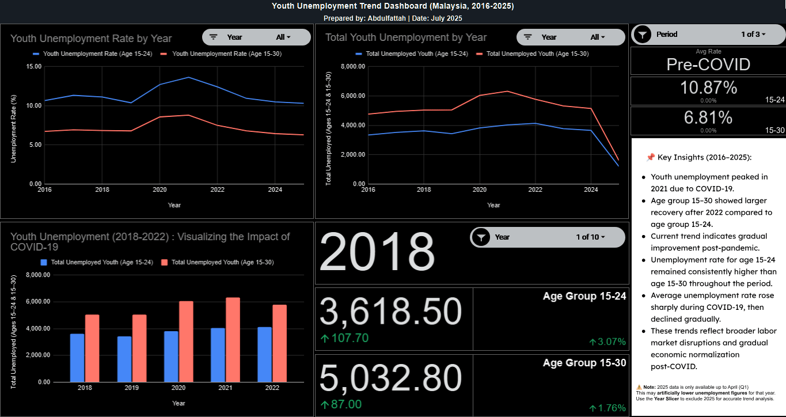
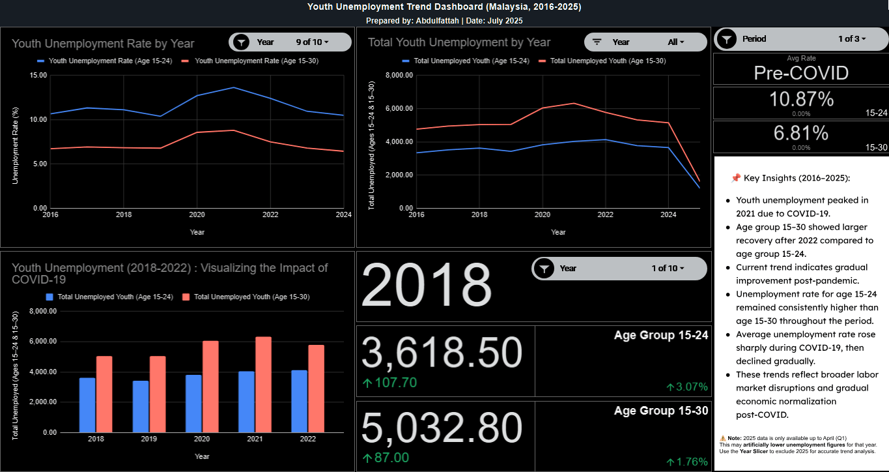
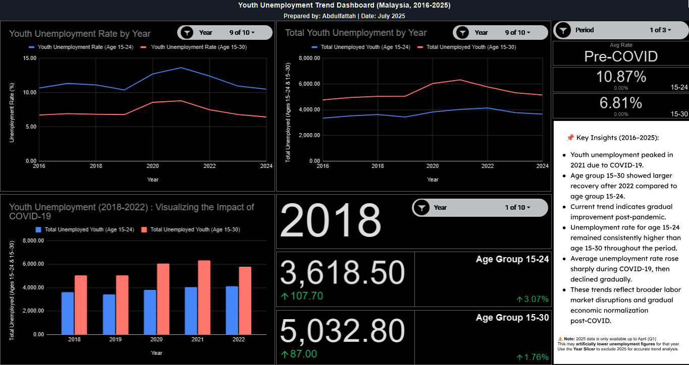
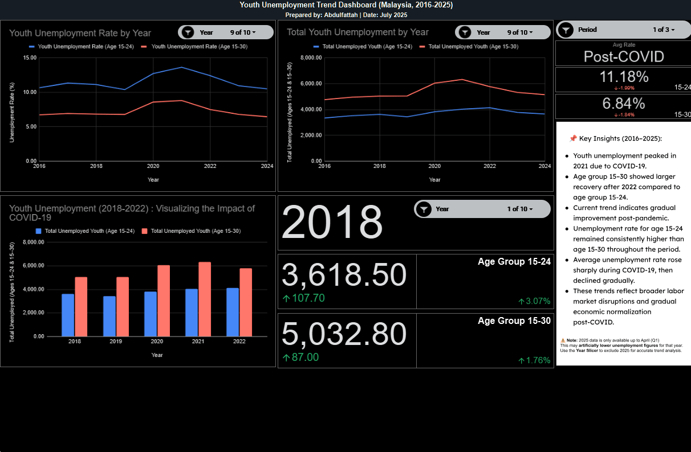

# Youth Unemployment in Malaysia (2016-2025) - Google Sheets Dashboard

This project analyzes **Youth Unemployment Trends in Malaysia from 2016-2025** and presents the results in a Google Sheets dashboard. The goal is to show how youth unemployment evolved before, during and after COVID-19 and to practice the full **Ask → Prepare → Process → Analyze → Share** analytics workflow using real open data.

If you prefer a written case study, the full phase-by-phase report is available in the root of this repo as:


---

### Dashboard preview

<p align="center">
  
</p>

### Unemployment Rate trend line interaction (GIF)

<p align="center">
  
</p>

### Total Youth Unemployment trend line interaction (GIF)

<p align="center">
  
</p>

### Average Rate KPI card interaction (GIF)

<p align="center">
  
</p>

### KPI card interaction (GIF)

<p align="center">
  
</p>

## Live interactive dashboard (Google Sheets)

View the live dashboard (view-only):

👉 [Youth Unemployment Trend Dashboard - Malaysia, 2016-2025](https://docs.google.com/spreadsheets/d/1ZrbPz02z87nSFQuP5B2SL8OxbTpvAPaPmHJvqHJfLZo/edit?usp=sharing)

### Using the Year KPI scorecards

The KPI cards (total unemployed + % change) are designed to show **one year at a time**.

In the **Year** slicer:

1. Click the slicer dropdown
2. Click **Clear** to deselect all years
3. Select **exactly one** year (e.g. 2021)

If multiple years are selected, Google Sheets will show an error for the scorecards.

Always select **only one year** to see the correct KPI values.

---

## Tech & Tools

- **Google Sheets**
  - Data checks and light processing
  - `YEAR()` formula to derive year
  - Pivot tables for annual averages
  - `AVERAGEIF` / `AVERAGEIFS` for pre/during/post-COVID comparisons   
  - Charts, slicers and dashboard layout
- **Data source:**  
  Open government data from **Department of Statistics Malaysia (DOSM / OpenDOSM)** for youth unemployment (ages 15-24 and 15-30) from Jan 2016 to Apr 2025
- **Documentation:** Markdown + PDF (Phase 1-6 write-up)

This project is intentionally Sheet-only to show what I can do with just a spreadsheet stack.

---

## Repository structure

```text
01_Ask/
  project_brief.md            # problem, stakeholders, business task
  analysis_questions.md       # core questions for the analysis
  data_sources.md             # description of the DOSM dataset

02_Prepare/
  youth_unemployment_2016_2025.csv          # raw data from OpenDOSM
  Youth_Unemployment_Data_Analysis_log.md   # simple download/check log

03_Process/
  process_notes.md             # notes on creating Cleaned_Data, adding Year, formatting

04_Analyze/
  PivotTable_Rate_15_24.png
  PivotTable_Rate_15_30.png
  PivotTable_Rate_Combined.png
  Youth_Unemployment_Trend_Chart.png
  Youth_Unemployment_2018_2022_Visualization_COVID.png

05_Share/
  Dashboard_full_preview.png                            # final Sheets dashboard (static preview)
  rate_kpi.gif                                          # KPI card animation for unemployment rate
  total_kpi.gif                                         # KPI card animation for total unemployed
  rate_line.gif                                         # line chart animation
  total_line.gif                                        # total unemployed trend animation
  Youth_Unemployment_Data_Analysis_Phase_1_to_6.pdf     # full phase 1-6 report
```

---

## Project overview

### Phase 1 - Ask

* **Problem:** Youth unemployment is a persistent issue in Malaysia. The Ministry of Economy and related agencies need to understand long-term trends to plan interventions for ages 15-30
* **Stakeholders:** policy makers, programme planners and youth-focused agencies
* **Key questions:**

  1. How have youth unemployment rates changed from 2016-2025?
  2. What happened during and after COVID-19?
  3. Are unemployment rates improving or worsening over time?

### Phase 2 - Prepare

* Downloaded youth unemployment data (2016-2025) from OpenDOSM
* Applied filters to check for:

  * missing values
  * inconsistent formats
  * obvious outliers
* Dataset was already tidy: complete monthly data, consistent date format and numeric unemployment metrics for both age groups

### Phase 3 - Process

* Duplicated the raw sheet as **`Cleaned_Data`** to keep the original intact
* Added a **`Year`** column with `=YEAR(Date)` for aggregation
* Normalised date/number formatting to avoid chart or pivot issues
* Dataset was then ready for pivot tables and charts

### Phase 4 - Analyze

Using pivot tables and charts in Sheets:

1. **Annual Unemployment Rate (2016-2025)**

   * Pivot tables average unemployment rate by year for:

     * Age 15-24
     * Age 15-30 
   * Insight: unemployment rises toward 2020-2021, peaks, then gradually declines. The 15-24 group shows sharper movements and higher peaks, indicating more vulnerability

2. **Trend Line Chart**

   * Line chart of annual rates for both age groups
   * Shows clear spike during COVID (2020-2021) and recovery after 2021, with 15-24 remaining consistently higher

3. **COVID-19 Impact (2018-2022)**

   * Bar chart of total unemployed 2018-2022 plus a summary table of average rates **pre-, during and post-COVID** using `AVERAGEIF`/`AVERAGEIFS`
   * Insight:

     * Both groups spike during COVID
     * Age 15-30 shows clearer recovery in 2022
     * Age 15-24 stays elevated, suggesting slower reintegration into the workforce

---

## Phase 5 - Share (Dashboard & Story)

The final Google Sheets dashboard includes:

* Yearly line chart for unemployment rates (15-24 vs 15-30)
* Total unemployed by year chart
* COVID-impact bar chart (2018-2022)
* KPI cards for:

  * current unemployment rate
  * average rate by period (pre/during/post-COVID)
* Slicers for year and age group
* A **key insights** text panel and analytical notes

The PDF (`05_Share/Youth_Unemployment_Data_Analysis_Phase_1_to_6.pdf`) summarises:

* Executive summary for decision-makers
* Key visuals with explanations
* Pre/during/post-COVID comparisons
* Recommendations such as:

  * targeted reskilling for 15-24
  * youth hiring incentives
  * stronger job-matching services
  * continuous monitoring of youth unemployment

---

## What this project demonstrates

**Data Analyst skills**

* Framing policy-relevant questions from public data
* Validating and lightly processing real government data
* Building pivot-based analyses and interpreting trends
* Designing clear charts & KPIs in a spreadsheet environment
* Communicating results through a written phase-by-phase report and dashboard

**Data/Analytics Engineer skills**

* Structuring a project using the **Ask → Prepare → Process → Analyze → Share** framework
* Organising data, documentation and visuals so others can reproduce the work
* Using formulas (`YEAR`, `AVERAGEIF`, `AVERAGEIFS`) and pivot tables as a lightweight analytics stack